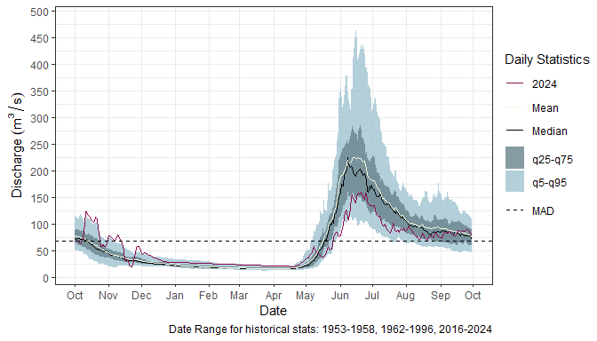

Generating Hydrometric Reports with StreamTrackR
================

# **Overview**

**Version:** 1.0.0  
**Last Edited:** 2025-01-29  
**Author:** Paula Soto  
**Email:** <paula.soto@dfo-mpo.gc.ca>

This vignette demonstrates how to use the `streamTrackR` project to
generate hydrometric condition reports. The workflow utilizes an
RMarkdown template and specified parameters to produce an HTML report
using Water Survey of Canada (WSC) station data.

### Setup Instructions

1.  Clone the project from the repository using your preferred method.
    Below is one example of how to do it in the R Studio terminal:

``` bash
git clone https://github.com/pausoto7/StreamTrackR.git
```

2.  Install required R packages

Install `hydroGraphR` from GitHub. `hydroGraphR` is an R package
designed to simplify the process of creating hydrographs.

``` r
# Install devtools if not already installed
install.packages("devtools")

# Install hydroGraphR
devtools::install_github("pausoto7/hydroGraphR")
```

Install the rest of the required R packages from CRAN:

``` r
install.packages(c("ggplot2",  "formattable", "knitr", "kableExtra",
                       "rmarkdown", "lubridate", "dplyr", "tidyr"))
```

3.  Open the project in RStudio and open `run_hydro_report.R` to begin.

# **Getting started**

## Setting Up

The first step is to download the required libraries and create an
isolated environment for your script to run in.

``` r
library(tidyhydat)
library(hydroGraphR) 
library(dplyr)

# Create a new environment for rendering 
isolated_env <- new.env()
```

## Define the file name and output directory

Next, define what the name of your file will be. In this example the
report will be for conditions in the Yukon. Any information may be
included here, but the file must end in “.html”. In this example
information on the location of the report is included along with the
date it is run (today). Other information that could be helpful to
include would be whether the report will be output in calendar or water
year format.

The following lines add a “Reports” folder into the project if one
doesn’t already exist.

``` r
file_name <- paste0("Reports/Yukon Condition Report", Sys.Date(), ".html")

# Add a "Reports" folder if it doesn't already exist
if (!dir.exists("Reports")) 
  { dir.create("Reports") }
```

## Rendering the Report

The `rmarkdown::render` function is used to generate the report. The
function takes the following parameters:

- **Stations**: A list of WSC station IDs for stations that should be
  include in the report. Station ID’s can be found on the [WSC
  website](https://wateroffice.ec.gc.ca/search/real_time_e.html).
- **YOI**: The year of interest for the data.
- **Location**: The location used for the title of the report.
- **WY**: Logical value indicating whether to present hydrograph by
  water year (Nov-Oct)(`TRUE`) or calendar year (Jan-Dec)(`FALSE`).

``` r
# Render the R Markdown report
rmarkdown::render(
  here::here("hydrometric_report.Rmd"),
  output_file = file_name,
  params = list(
    stations = c(
      "09AG001", "09EA006", "09CA002"
    ),
    YOI = 2025,
    location = "Yukon", # To be used for the title of the report
    WY  = FALSE
  ),
  envir = isolated_env
)
```

## Viewing the Report

Once the rendering process is complete, the report will be saved in the
`Reports` directory. Open the HTML file to view the results.

Note that all the figures produced in the report will also be present in
the similarly named folder within the same `Reports` directory.

<br>

# *Example Report Output:*

<!-- -->
<h1 style="font-size: 2.8em;">
Yukon Hydrometric Conditions Report
</h1>
<h2 style="font-size: 1.8em; color: #5b5b5b;">
January 29, 2025
</h2>

##### This report provides an overview of current hydrologic conditions at selected stations. Level and flow data are sourced from both historical and real-time hydrometric data published by Water Survey of Canada. See below table for terms and definitions used in station tables.

<table class="table table-condensed" style>
<thead>
<tr>
<th style="text-align:left;font-weight: bold;background-color: rgba(240, 240, 240, 255) !important;">
Term
</th>
<th style="text-align:left;font-weight: bold;background-color: rgba(240, 240, 240, 255) !important;">
Definition
</th>
</tr>
</thead>
<tbody>
<tr>
<td style="text-align:left;">
Station Number
</td>
<td style="text-align:left;">
WSC station number with a link to the WSC station website.
</td>
</tr>
<tr>
<td style="text-align:left;">
Parameter
</td>
<td style="text-align:left;">
Parameter type, either flow or water level.
</td>
</tr>
<tr>
<td style="text-align:left;">
Mean (Today)
</td>
<td style="text-align:left;">
The average value of today’s (or most recent date captured)
measurements. <span style="background: #bef7a6 ;">Green</span> symbology
indicates the value is between Q25-Q75.
<span style="background: #f7a6a6 ;">Red</span> indicates the value is
out of this range.
</td>
</tr>
<tr>
<td style="text-align:left;">
Historical Mean (Today)
</td>
<td style="text-align:left;">
The average value of the measurements on this date over the historical
period.
</td>
</tr>
<tr>
<td style="text-align:left;">
Percent of Historical
</td>
<td style="text-align:left;">
The percentage of today’s value compared to the historical average.
</td>
</tr>
<tr>
<td style="text-align:left;">
MAD
</td>
<td style="text-align:left;">
Mean Annual Discharge, a measure of the average amount of discharge
through a river or stream over the course of a year.
</td>
</tr>
<tr>
<td style="text-align:left;">
Q25 (Today)
</td>
<td style="text-align:left;">
The 25th percentile of today’s data distribution, indicating that 25% of
the data points are below this value.
</td>
</tr>
<tr>
<td style="text-align:left;">
Q75 (Today)
</td>
<td style="text-align:left;">
The 75th percentile of today’s data distribution, indicating that 75% of
the data points are below this value.
</td>
</tr>
<tr>
<td style="text-align:left;">
72 Hr Change
</td>
<td style="text-align:left;">
The change in the measurement over the past 72 hours.
</td>
</tr>
<tr>
<td style="text-align:left;">
Date Ranges
</td>
<td style="text-align:left;">
The years during which the data was collected and included in analysis.
</td>
</tr>
<tr>
<td style="text-align:left;">
Trajectory
</td>
<td style="text-align:left;">
The trend or direction of the measurement over a three day period.
</td>
</tr>
</tbody>
</table>
<!-- -->

### BIG SALMON RIVER NEAR CARMACKS

<!-- -->
<table class="table" style="margin-left: auto; margin-right: auto;border-bottom: 0;">
<thead>
<tr>
<th style="text-align:center;color: white !important;background-color: rgba(0, 151, 169, 255) !important;">
Station Number
</th>
<th style="text-align:center;color: white !important;background-color: rgba(0, 151, 169, 255) !important;">
Parameter
</th>
<th style="text-align:center;color: white !important;background-color: rgba(0, 151, 169, 255) !important;">
Mean (Today)
</th>
<th style="text-align:center;color: white !important;background-color: rgba(0, 151, 169, 255) !important;">
Historical Mean (Today)
</th>
<th style="text-align:center;color: white !important;background-color: rgba(0, 151, 169, 255) !important;">
Percent of Historical
</th>
<th style="text-align:center;color: white !important;background-color: rgba(0, 151, 169, 255) !important;">
MAD
</th>
<th style="text-align:center;color: white !important;background-color: rgba(0, 151, 169, 255) !important;">
Q25 (Today)
</th>
<th style="text-align:center;color: white !important;background-color: rgba(0, 151, 169, 255) !important;">
Q75 (Today)
</th>
<th style="text-align:center;color: white !important;background-color: rgba(0, 151, 169, 255) !important;">
72 Hr Change
</th>
<th style="text-align:center;color: white !important;background-color: rgba(0, 151, 169, 255) !important;">
Date Ranges
</th>
<th style="text-align:center;color: white !important;background-color: rgba(0, 151, 169, 255) !important;">
Trajectory
</th>
</tr>
</thead>
<tbody>
<tr>
<td style="text-align:center;">
<a href="https://wateroffice.ec.gc.ca/report/real_time_e.html?stn=09AG001" target="_blank">09AG001</a>
</td>
<td style="text-align:center;">
Flow (m<sup>3</sup>/s)
</td>
<td style="text-align:center;">
<span style="background: #bef7a6">56.1</span>
</td>
<td style="text-align:center;">
62.1
</td>
<td style="text-align:center;">
90
</td>
<td style="text-align:center;">
69.7
</td>
<td style="text-align:center;">
45.3
</td>
<td style="text-align:center;">
73.9
</td>
<td style="text-align:center;">
-5.6
</td>
<td style="text-align:center;">
1953-1958, 1962-1996, 2016-2024
</td>
<td style="text-align:center;">
Falling
</td>
</tr>
<tr>
<td style="text-align:center;">
<a href="https://wateroffice.ec.gc.ca/report/real_time_e.html?stn=09AG001" target="_blank">09AG001</a>
</td>
<td style="text-align:center;">
Level (m)
</td>
<td style="text-align:center;">
<span style="background: #bef7a6">1.692</span>
</td>
<td style="text-align:center;">
1.649
</td>
<td style="text-align:center;">
103
</td>
<td style="text-align:center;">
NA
</td>
<td style="text-align:center;">
1.480
</td>
<td style="text-align:center;">
1.810
</td>
<td style="text-align:center;">
-0.072
</td>
<td style="text-align:center;">
2016-2025
</td>
<td style="text-align:center;">
Falling
</td>
</tr>
</tbody>
<tfoot>
<tr>
<td style="padding: 0; " colspan="100%">
<sup></sup> Note:<br> Flow stats were calculated using October 18, 2024
data <br> Level stats were calculated using December 31, 2024 data
</td>
</tr>
</tfoot>
</table>

<br>

# Conclusion

This vignette has demonstrated how to use the `streamTrackR` project to
generate a custom hydrometric report. Modify the parameters as needed to
customize the stations, year of interest, and location for your specific
requirements.

<br>

### To modify this project

If you’d like to modify this project, please **fork** it and make
changes in your own version. If you have improvements, feel free to
submit a **pull request**!

<br>
